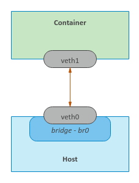

== 概述

在本系列的第 1 部分中 ，我们演示了使用命名空间 UTS、User、PID和 Mount来隔离主机名、用户/组 ID 和进程 ID 。

在本文中，我们将继续探讨Mount和Network 命名空间。我们不会探索IPC命名空间。

命名空间实践

=== 挂载命名空间

接下来，我们将使用以下go 程序来模拟上面的UTS、User、 PID和Mount 、命名空间隔离：

[source,go]
----
----
通过在TB中执行以下命令来 创建并更改目录$GOPATH/mount：

[source,bash]
----
$ mkdir -p $GOPATH/mount

$ cd $GOPATH/mount
----

将上述代码复制到当前目录下的程序文件main.go中。

要编译程序文件main.go ，请在 TB中执行以下命令：

[source,bash]
$ go build main.go

要运行程序main ，请在TB中执行以下命令：

[source,bash]
$ ./main

以下是典型的输出：

[source]
output.1
2020/03/14 22:05:46 启动进程 ./main 参数：[./main]
2020/03/14 22:05:46 准备运行命令...
2020/03/14 22:05:46 启动进程 ./main 参数：[./main CLONE]
2020/03/14 22:05:46 准备执行容器 shell ...
2020/03/14 22:05:46 更改到 /tmp 目录...
2020/03/14 22:05:46 安装/作为私人...
2020/03/14 22:05:46 将 rootfs/ 绑定到 rootfs/ ...
2020/03/14 22:05:46 将新根转入 rootfs/ ...
2020/03/14 22:05:46 切换到 / 目录...
2020/03/14 22:05:46 挂载 /tmp 作为 tmpfs ...
2020/03/14 22:05:46 挂载 /proc 文件系统 ...
2020/03/14 22:05:46 将 /.old_root 挂载为私有...
2020/03/14 22:05:46 从 /.old_root 卸载父 rootfs ...
->

命令提示符将更改为->。

要显示简单容器的主机名，请在TB中执行以下命令：

[source]
-> hostname

以下是典型的输出：

[source]
output.2
leopard

要显示新命名空间中的用户 ID 和组 ID，请在TB中执行以下命令：

[source]
-> id

以下是典型的输出：

[source]
ouput.3
uid=0(root) gid=0(root) groups=0(root)

要显示简单容器中的所有进程，请在TB中执行以下命令：

[source]
-> ps -fu

以下是典型的输出：

[source]
output.4
USER       PID %CPU %MEM    VSZ   RSS TTY      STAT START   TIME COMMAND
root         1  0.0  0.0   4628   824 pts/1    S    22:05   0:00
root         8  0.0  0.0  37368  3368 pts/1    R+   22:05   0:00 ps -fu

要列出新命名空间中的所有挂载点，请在TB中执行以下命令 ：

[source]
-> cat /proc/mounts | sort

以下是典型的输出：

[source]
output.5
/dev/sda1 / ext4 rw,relatime,errors=remount-ro,data=ordered 0 0
proc /proc proc rw,relatime 0 0
tmpfs /tmp tmpfs rw,relatime 0 0

要列出新命名空间中/下的所有文件，请在TB中执行以下命令 ：

[source,bash]
----
# ls -l /
----

以下是典型的输出：

[source]
output.6
total 68
drwxr-xr-x   2 nobody nogroup 4096 Feb  3 20:24 bin
drwxr-xr-x   2 nobody nogroup 4096 Apr 24  2018 boot
drwxr-xr-x   2 nobody nogroup 4096 Feb  3 20:24 dev
drwxr-xr-x  29 nobody nogroup 4096 Feb  3 20:24 etc
drwxr-xr-x   2 nobody nogroup 4096 Apr 24  2018 home
drwxr-xr-x   8 nobody nogroup 4096 May 23  2017 lib
drwxr-xr-x   2 nobody nogroup 4096 Feb  3 20:23 lib64
drwxr-xr-x   2 nobody nogroup 4096 Feb  3 20:23 media
drwxr-xr-x   2 nobody nogroup 4096 Feb  3 20:23 mnt
drwxr-xr-x   2 nobody nogroup 4096 Feb  3 20:23 opt
dr-xr-xr-x 329 root   root       0 Mar 21 17:32 proc
drwx------   2 nobody nogroup 4096 Feb  3 20:24 root
drwxr-xr-x   4 nobody nogroup 4096 Feb  3 20:23 run
drwxr-xr-x   2 nobody nogroup 4096 Feb  3 20:24 sbin
drwxr-xr-x   2 nobody nogroup 4096 Feb  3 20:23 srv
drwxr-xr-x   2 nobody nogroup 4096 Apr 24  2018 sys
drwxrwxrwt   2 root   root      60 Mar 21 17:32 tmp
drwxr-xr-x  10 nobody nogroup 4096 Feb  3 20:23 usr
drwxr-xr-x  11 nobody nogroup 4096 Feb  3 20:24 var

要列出简单容器中文件/tmp/leopard.txt的属性，请在TB中执行以下命令：

[source]
-> ls -l /tmp/leopard.txt

以下是典型的输出：

[source]
output.7
-rw-r--r-- 1 root root 7 Mar 14 22:05 /tmp/leopard.txt

要列出与简单容器关联的所有命名空间，请在TB中执行以下命令：

[source]
-> ls -l /proc/$$/ns

以下是典型的输出：

[source]
output.8
total 0
lrwxrwxrwx 1 root root 0 Mar 14 22:07 cgroup -> 'cgroup:[4026531835]'
lrwxrwxrwx 1 root root 0 Mar 14 22:07 ipc -> 'ipc:[4026531839]'
lrwxrwxrwx 1 root root 0 Mar 14 22:07 mnt -> 'mnt:[4026532609]'
lrwxrwxrwx 1 root root 0 Mar 14 22:07 net -> 'net:[4026531993]'
lrwxrwxrwx 1 root root 0 Mar 14 22:07 pid -> 'pid:[4026532611]'
lrwxrwxrwx 1 root root 0 Mar 14 22:07 pid_for_children -> 'pid:[4026532611]'
lrwxrwxrwx 1 root root 0 Mar 14 22:07 user -> 'user:[4026532608]'
lrwxrwxrwx 1 root root 0 Mar 14 22:07 uts -> 'uts:[4026532610]'

要退出简单容器，请在TB中执行以下命令：

[source]
-> exit

成功 ！！！我们使用unshare命令和一个简单的go程序演示了组合的UTS、 User、PID和Mount命名空间。

=== Network Namespace

最后，现在让我们将Network命名空间分层在UTS、User、PID和Mount命名空间之上 。

要启动一个简单的容器，其网络以及挂载点、进程 ID、用户/组 ID 和主机名都与父命名空间隔离，请在 TB 中执行以下命令：

[source,bash]
$ unshare -uUrpfmn --mount-proc /bin/sh

-n选项启用网络命名空间。

命令提示符将更改为#。

要列出新命名空间中的所有网络接口，请在TB中执行以下命令：

[source,bash]
----
# ip link
----

以下是典型的输出：

[source]
output.9
1: lo: <LOOPBACK> mtu 65536 qdisc noop state DOWN mode DEFAULT group default qlen 1000
    link/loopback 00:00:00:00:00:00 brd 00:00:00:00:00:00

从上面的 Output.12 中，我们只看到环回( 127.0.0.1 ) 接口，并且它处于DOWN 状态。

要在新命名空间中打开环回接口，请在TB中执行以下命令 ：
[source, bash]
----
# ip link set dev lo up
----

要测试新命名空间中的环回接口，请在TB中执行以下命令 ：

[source, bash]
----
# ping 127.0.0.1 -c3
----

以下是典型的输出：

[source]
output.10
PING 127.0.0.1 (127.0.0.1) 56(84) bytes of data.
64 bytes from 127.0.0.1: icmp_seq=1 ttl=64 time=0.022 ms
64 bytes from 127.0.0.1: icmp_seq=2 ttl=64 time=0.024 ms
64 bytes from 127.0.0.1: icmp_seq=3 ttl=64 time=0.020 ms

--- 127.0.0.1 ping statistics ---
3 packets transmitted, 3 received, 0% packet loss, time 2040ms
rtt min/avg/max/mdev = 0.020/0.022/0.024/0.001 ms

我们需要在父命名空间中创建一个桥接网络接口。网桥 是用于连接两个或多个网络设备的虚拟网络交换机。

要在父命名空间中创建名为br0的桥接接口，请在TA中执行以下命令：

[source,bash]
$ brctl addbr br0

要列出父命名空间中的所有桥接口，请在TA 中执行以下命令：

[source,bash]
$ brctl show

以下是典型的输出：

[source]
output.11
bridge name bridge id           STP enabled interfaces
br0         8000.000000000000   no

让我们为br0分配地址172.20.1.2。要为父命名空间中的桥接口br0分配 IP 地址，请在TA中执行以下命令：

[source,bash]
$ ip addr add 172.20.1.2/24 dev br0

要在父命名空间中启动桥接接口br0 ，请在TA中执行以下命令：

[source,bash]
$ ip link set br0 up

要列出父命名空间中的所有网络接口，请在TA 中执行以下命令：

[source,bash]
$ ip link

以下是典型的输出：

[source]
output.12
1: lo: <LOOPBACK,UP,LOWER_UP> mtu 65536 qdisc noqueue state UNKNOWN mode DEFAULT group default qlen 1000
    link/loopback 00:00:00:00:00:00 brd 00:00:00:00:00:00
2: enp5s0: <NO-CARRIER,BROADCAST,MULTICAST,UP> mtu 1500 qdisc fq_codel state DOWN mode DEFAULT group default qlen 1000
    link/ether 18:18:18:05:05:05 brd ff:ff:ff:ff:ff:ff
3: br0: <BROADCAST,MULTICAST,UP,LOWER_UP> mtu 1500 qdisc noqueue state UNKNOWN mode DEFAULT group default qlen 1000
    link/ether 0a:ae:d0:65:21:bb brd ff:ff:ff:ff:ff:ff

可以将虚拟以太网设备veth添加到网络 命名空间。它们可以充当网络命名空间之间的隧道，并且始终成对创建。在一对设备中的一个设备上传输的数据包会立即在另一个设备上接收。该对的一端将位于父命名空间中，而另一端将位于新命名空间中。

下图说明了具有虚拟以太网对的桥接网络：

.Bridge Network
[.cneter]

桥接网络
桥接网络
要在父命名空间中创建名为veth0和 veth1的 veth接口对，请在TA 中执行以下命令：

[source,bash]
----
$ ip link add veth0 type veth peer name veth1
----

要列出父命名空间中的所有网络接口，请在TA 中执行以下命令：

[source,bash]
$ip link

以下是典型的输出：

[source]
output.13
1: lo: <LOOPBACK,UP,LOWER_UP> mtu 65536 qdisc noqueue state UNKNOWN mode DEFAULT group default qlen 1000
    link/loopback 00:00:00:00:00:00 brd 00:00:00:00:00:00
2: enp5s0: <NO-CARRIER,BROADCAST,MULTICAST,UP> mtu 1500 qdisc fq_codel state DOWN mode DEFAULT group default qlen 1000
    link/ether 18:18:18:05:05:05 brd ff:ff:ff:ff:ff:ff
3: br0: <BROADCAST,MULTICAST,UP,LOWER_UP> mtu 1500 qdisc noqueue state UNKNOWN mode DEFAULT group default qlen 1000
    link/ether 0a:ae:d0:65:21:bb brd ff:ff:ff:ff:ff:ff
4: veth1@veth0: <BROADCAST,MULTICAST,M-DOWN> mtu 1500 qdisc noop state DOWN mode DEFAULT group default qlen 1000
    link/ether c6:46:7c:18:1c:ef brd ff:ff:ff:ff:ff:ff
5: veth0@veth1: <BROADCAST,MULTICAST,M-DOWN> mtu 1500 qdisc noop state DOWN mode DEFAULT group default qlen 1000
    link/ether 76:3e:78:4e:9d:28 brd ff:ff:ff:ff:ff:ff

结尾veth0应该位于父命名空间中，而结尾veth1 应该位于新命名空间中。

要将结尾veth1放入新命名空间中，我们需要识别命令unshare的进程 ID 。

要查找unshare的 pid 并将其存储在环境变量 UPID中，请在TA中执行以下命令：

[source,bash]
$ export UPID=$(pidof unshare)

要将末尾的veth1放入新的命名空间中，请在TA中执行以下命令 ：

[source,bash]
$ ip link set veth1 netns $UPID

要列出父命名空间中的所有网络接口，请在TA 中执行以下命令：

[source,bash]
$ ip link

以下是典型的输出：

[source]
output.14
1: lo: <LOOPBACK,UP,LOWER_UP> mtu 65536 qdisc noqueue state UNKNOWN mode DEFAULT group default qlen 1000
    link/loopback 00:00:00:00:00:00 brd 00:00:00:00:00:00
2: enp5s0: <NO-CARRIER,BROADCAST,MULTICAST,UP> mtu 1500 qdisc fq_codel state DOWN mode DEFAULT group default qlen 1000
    link/ether 18:18:18:05:05:05 brd ff:ff:ff:ff:ff:ff
3: br0: <BROADCAST,MULTICAST,UP,LOWER_UP> mtu 1500 qdisc noqueue state UNKNOWN mode DEFAULT group default qlen 1000
    link/ether 0a:ae:d0:65:21:bb brd ff:ff:ff:ff:ff:ff
5: veth0@if6: <BROADCAST,MULTICAST,M-DOWN> mtu 1500 qdisc noop state DOWN mode DEFAULT group default qlen 1000
    link/ether 76:3e:78:4e:9d:28 brd ff:ff:ff:ff:ff:ff

要列出新命名空间中的所有网络接口，请在TB中执行以下命令：

[source,bash]
----
# ip link
----

以下是典型的输出：

[source]
output.15
1: lo: <LOOPBACK,UP,LOWER_UP> mtu 65536 qdisc noqueue state UNKNOWN mode DEFAULT group default qlen 1000
    link/loopback 00:00:00:00:00:00 brd 00:00:00:00:00:00
2: veth1@if3: <BROADCAST,MULTICAST,M-DOWN> mtu 1500 qdisc noop state DOWN mode DEFAULT group default qlen 1000
    link/ether c6:46:7c:18:1c:ef brd ff:ff:ff:ff:ff:ff

比较Output.15和Output.14，我们发现它们完全不同。

要将末端veth0连接到父命名空间中的网桥br0 ，请在TA中执行以下命令：

[source,bash]
$ ip link set veth0 master br0 up

让我们为veth0分配地址172.20.1.3。要为父命名空间中的网络接口veth0分配 IP 地址，请在TA中执行以下命令：

[source,bash]
$ ip addr add 172.20.1.3/24 dev veth0

要在父命名空间中启动网络接口veth0 ，请在TA中执行以下命令：

[source,bash]
$ sudo ip link set veth0 up

让我们为veth1分配地址172.20.1.4。要为新命名空间中的网络接口veth1分配 IP 地址，请在TB中执行以下命令：

[source,bash]
----
# ip addr add 172.20.1.4/24 dev veth1
----

要在新命名空间中启动网络接口veth1 ，请在TB中执行以下命令：

[source,bash]
----
# ip link set veth1 up
----

要测试父命名空间中（容器的）IP 地址172.20.1.4 ，请在TA中执行以下命令：

[source,bash]
$ ping 172.20.1.4 -c3

以下是典型的输出：

[source]
output.16
PING 172.20.1.4 (172.20.1.4) 56(84) bytes of data.
64 bytes from 172.20.1.4: icmp_seq=1 ttl=64 time=0.079 ms
64 bytes from 172.20.1.4: icmp_seq=2 ttl=64 time=0.038 ms
64 bytes from 172.20.1.4: icmp_seq=3 ttl=64 time=0.040 ms

--- 172.20.1.4 ping statistics ---
3 packets transmitted, 3 received, 0% packet loss, time 2036ms
rtt min/avg/max/mdev = 0.038/0.052/0.079/0.019 ms

同样，要测试新命名空间中的 IP 地址172.20.1.3 （主机的），请在TB中执行以下命令：

[source,bash]
----
# ping 172.20.1.3 -c3
----

以下是典型的输出：

[source]
outputPING 172.20.1.3 (172.20.1.3) 56(84) bytes of data.
64 bytes from 172.20.1.3: icmp_seq=1 ttl=64 time=0.072 ms
64 bytes from 172.20.1.3: icmp_seq=2 ttl=64 time=0.039 ms
64 bytes from 172.20.1.3: icmp_seq=3 ttl=64 time=0.044 ms

--- 172.20.1.3 ping statistics ---
3 packets transmitted, 3 received, 0% packet loss, time 2044ms
rtt min/avg/max/mdev = 0.039/0.051/0.072/0.016 ms

耶 ！！！我们通过使用unshare命令组合 UTS、User、PID、Mount和 Network命名空间，成功演示了一个简单的容器。

要清理我们之前创建的桥接口，我们需要先将其关闭，然后将其删除。

要关闭父命名空间中的桥接口br0 ，请在TA中执行以下命令：

[source,bash]
$ sudo ip link set br0 down

要删除父命名空间中的桥接口br0 ，请在TA中执行以下命令：

[source,bash]
$ sudo brctl delbr br0

接下来，我们将使用以下go程序来模拟上面的UTS、User、 PID、Mount和Network 、命名空间隔离：

[source,go]
----
package main

import (
	"fmt"
	"github.com/vishvananda/netlink"
	"log"
	"net"
	"os"
	"os/exec"
	"syscall"
)

const (
	Bridge   = "br0"
	BridgeIp = "172.20.1.2/24"
	Lo       = "lo"
	Peer0    = "veth0"
	Peer0Ip  = "172.20.1.3/24"
	Peer1    = "veth1"
	Peer1Ip  = "172.20.1.4/24"
)

func createTxtFile() {
	f, err := os.Create("/tmp/leopard.txt")
	if err != nil {
		panic(err)
	}

	_, err = f.WriteString("leopard")
	if err != nil {
		panic(err)
	}

	_ = f.Close()
}

func checkBridge() (*netlink.Bridge, error) {
	la := netlink.NewLinkAttrs()
	la.Name = Bridge

	br := &netlink.Bridge{LinkAttrs: la}

	if _, err := net.InterfaceByName(Bridge); err != nil {
		return br, err
	}

	return br, nil
}

func setupBridge() error {
	br, err := checkBridge()
	if err != nil {
		log.Printf("Bridge %s does not exists ...\n", Bridge)
		log.Printf("Creating the Bridge %s ...\n", Bridge)

		if err = netlink.LinkAdd(br); err != nil {
			fmt.Println(err)
			return err
		}
	} else {
		log.Printf("Bridge %s already exists ...\n", Bridge)
	}

	addr, err := netlink.ParseAddr(BridgeIp)
	if err != nil {
		fmt.Println(err)
		return err
	}

	log.Printf("Attaching address %s to the Bridge %s ...\n", BridgeIp, Bridge)

	if err = netlink.AddrAdd(br, addr); err != nil {
		fmt.Println(err)
		return err
	}

	log.Printf("Activating the Bridge %s ...\n", Bridge)

	if err = netlink.LinkSetUp(br); err != nil {
		fmt.Println(err)
		return err
	}

	return nil
}

func deleteBridge() error {
	br, err := checkBridge()
	if err != nil {
		fmt.Println(err)
		return err
	}

	log.Printf("Deactivating the Bridge %s ...\n", Bridge)

	if err := netlink.LinkSetDown(br); err != nil {
		fmt.Println(err)
		return err
	}

	log.Printf("Deleting the Bridge %s ...\n", Bridge)

	if err := netlink.LinkDel(br); err != nil {
		fmt.Println(err)
		return err
	}

	return nil
}

func setupVethPeers() error {
	br, err := checkBridge()
	if err != nil {
		fmt.Println(err)
		return err
	}

	la := netlink.NewLinkAttrs()
	la.Name = Peer0
	la.MasterIndex = br.Attrs().Index

	log.Printf("Creating the pairs %s and %s ...\n", Peer0, Peer1)

	// ip link add veth0 type veth peer name veth1
	veth := &netlink.Veth{LinkAttrs: la, PeerName: Peer1}
	if err := netlink.LinkAdd(veth); err != nil {
		fmt.Println(err)
		return err
	}

	log.Printf("Link %s as master of %s ...\n", Bridge, Peer0)

	// ip link set veth0 master br0
	if err = netlink.LinkSetMaster(veth, br); err != nil {
		fmt.Println(err)
		return err
	}

	log.Printf("Activating the pairs %s & %s ...\n", Peer0, Peer1)

	if err = netlink.LinkSetUp(veth); err != nil {
		fmt.Println(err)
		return err
	}

	return nil
}

func namespaceVethPeer(pid int) error {
	log.Printf("Getting the link for pair %s ...\n", Peer1)

	veth1, err := netlink.LinkByName(Peer1)
	if err != nil {
		fmt.Println(err)
		return err
	}

	log.Printf("Namespacing the pair %s with pid %d ...\n", Peer1, pid)

	// ip link set veth1 netns $UPID
	if err := netlink.LinkSetNsPid(veth1, pid); err != nil {
		fmt.Println(err)
		return err
	}

	return nil
}

func activateLo() error {
	log.Printf("Getting the link for pair %s ...\n", Lo)

	loIf, err := netlink.LinkByName(Lo)
	if err != nil {
		fmt.Println(err)
		return err
	}

	log.Printf("Activating %s ...\n", Lo)

	// ip link set dev lo up
	if err = netlink.LinkSetUp(loIf); err != nil {
		fmt.Println(err)
		return err
	}

	return nil
}

func activateVethPair(name, ip string) error {
	log.Printf("Getting the link for pair %s ...\n", name)

	veth, err := netlink.LinkByName(name)
	if err != nil {
		fmt.Println(err)
		return err
	}

	addr, err := netlink.ParseAddr(ip)
	if err != nil {
		fmt.Println(err)
		return err
	}

	log.Printf("Attaching address %s to the pair %s ...\n", ip, name)

	// ip addr add ip dev vethX
	if err = netlink.AddrAdd(veth, addr); err != nil {
		fmt.Println(err)
		return err
	}

	log.Printf("Activating the pair %s ...\n", name)

	// ip link set dev vethX up
	if err = netlink.LinkSetUp(veth); err != nil {
		fmt.Println(err)
		return err
	}

	return nil
}

func execContainerShell() {
	log.Printf("Ready to exec container shell ...\n")

	if err := syscall.Sethostname([]byte("leopard")); err != nil {
		panic(err)
	}

	log.Printf("Chaning to /tmp directory ...\n")

	if err := os.Chdir("/tmp"); err != nil {
		panic(err)
	}

	log.Printf("Mounting / as private ...\n")

	mf := uintptr(syscall.MS_PRIVATE | syscall.MS_REC)
	if err := syscall.Mount("", "/", "", mf, ""); err != nil {
		panic(err)
	}

	log.Printf("Binding rootfs/ to rootfs/ ...\n")

	mf = uintptr(syscall.MS_BIND | syscall.MS_REC)
	if err := syscall.Mount("rootfs/", "rootfs/", "", mf, ""); err != nil {
		panic(err)
	}

	log.Printf("Pivot new root at rootfs/ ...\n")

	if err := syscall.PivotRoot("rootfs/", "rootfs/.old_root"); err != nil {
		panic(err)
	}

	log.Printf("Changing to / directory ...\n")

	if err := os.Chdir("/"); err != nil {
		panic(err)
	}

	log.Printf("Mounting /tmp as tmpfs ...\n")

	mf = uintptr(syscall.MS_NODEV)
	if err := syscall.Mount("tmpfs", "/tmp", "tmpfs", mf, ""); err != nil {
		panic(err)
	}

	log.Printf("Mounting /proc filesystem ...\n")

	mf = uintptr(syscall.MS_NODEV)
	if err := syscall.Mount("proc", "/proc", "proc", mf, ""); err != nil {
		panic(err)
	}

	createTxtFile()

	log.Printf("Mounting /.old_root as private ...\n")

	mf = uintptr(syscall.MS_PRIVATE | syscall.MS_REC)
	if err := syscall.Mount("", "/.old_root", "", mf, ""); err != nil {
		panic(err)
	}

	log.Printf("Unmount parent rootfs from /.old_root ...\n")

	if err := syscall.Unmount("/.old_root", syscall.MNT_DETACH); err != nil {
		panic(err)
	}

	if err := activateLo(); err != nil {
		panic(err)
	}

	if err := activateVethPair(Peer1, Peer1Ip); err != nil {
		panic(err)
	}

	const sh = "/bin/sh"

	env := os.Environ()
	env = append(env, "PS1=-> ")

	if err := syscall.Exec(sh, []string{""}, env); err != nil {
		panic(err)
	}
}

func main() {
	log.Printf("Starting process %s with args: %v\n", os.Args[0], os.Args)

	const clone = "CLONE"

	if len(os.Args) > 1 && os.Args[1] == clone {
		// Clone
		execContainerShell()
	} else {
		// Parent
		if err := setupBridge(); err != nil {
			panic(err)
		}

		if err := setupVethPeers(); err != nil {
			panic(err)
		}

		if err := activateVethPair(Peer0, Peer0Ip); err != nil {
			panic(err)
		}
	}

	log.Printf("Ready to run command ...\n")

	cmd := exec.Command(os.Args[0], []string{clone}...)
	cmd.Stdin = os.Stdin
	cmd.Stdout = os.Stdout
	cmd.Stderr = os.Stderr
	cmd.SysProcAttr = &syscall.SysProcAttr{
		Cloneflags: syscall.CLONE_NEWUTS |
			syscall.CLONE_NEWUSER |
			syscall.CLONE_NEWNS |
			syscall.CLONE_NEWPID |
			syscall.CLONE_NEWNET,
		UidMappings: []syscall.SysProcIDMap{
			{ContainerID: 0, HostID: 0, Size: 1},
		},
		GidMappings: []syscall.SysProcIDMap{
			{ContainerID: 0, HostID: 0, Size: 1},
		},
	}

	if err := cmd.Start(); err != nil {
		panic(err)
	}

	if err := namespaceVethPeer(cmd.Process.Pid); err != nil {
		panic(err)
	}

	_ = cmd.Wait()

	_ = deleteBridge()
}

----

通过在TB中执行以下命令来 创建并更改目录$GOPATH/network：

[source,bash]
----
$ mkdir -p $GOPATH/network

$ cd $GOPATH/network
----

将上述代码复制到当前目录下的程序文件main.go中。

要编译程序文件main.go ，请在 TB中执行以下命令：

[source,bash]
$ go build main.go

要运行程序main ，请在TB中执行以下命令：

[source,bash]
$ ./main

以下是典型的输出：

[source]
----
output.18
2020/03/14 22:17:52 Starting process ./main with args: [./main]
2020/03/14 22:17:52 Bridge br0 does not exists ...
2020/03/14 22:17:52 Creating the Bridge br0 ...
2020/03/14 22:17:52 Attaching address 172.20.1.2/24 to the Bridge br0 ...
2020/03/14 22:17:52 Activating the Bridge br0 ...
2020/03/14 22:17:52 Creating the pairs veth0 and veth1 ...
2020/03/14 22:17:52 Link br0 as master of veth0 ...
2020/03/14 22:17:52 Activating the pairs veth0 & veth1 ...
2020/03/14 22:17:52 Getting the link for pair veth0 ...
2020/03/14 22:17:52 Attaching address 172.20.1.3/24 to the pair veth0 ...
2020/03/14 22:17:52 Activating the pair veth0 ...
2020/03/14 22:17:52 Ready to run command ...
2020/03/14 22:17:52 Getting the link for pair veth1 ...
2020/03/14 22:17:52 Namespacing the pair veth1 with pid 20367 ...
2020/03/14 22:17:52 Starting process ./main with args: [./main CLONE]
2020/03/14 22:17:52 Ready to exec container shell ...
2020/03/14 22:17:52 Chaning to /tmp directory ...
2020/03/14 22:17:52 Mounting / as private ...
2020/03/14 22:17:52 Binding rootfs/ to rootfs/ ...
2020/03/14 22:17:52 Pivot new root at rootfs/ ...
2020/03/14 22:17:52 Changing to / directory ...
2020/03/14 22:17:52 Mounting /tmp as tmpfs ...
2020/03/14 22:17:52 Mounting /proc filesystem ...
2020/03/14 22:17:52 Mounting /.old_root as private ...
2020/03/14 22:17:52 Unmount parent rootfs from /.old_root ...
2020/03/14 22:17:52 Getting the link for pair lo ...
2020/03/14 22:17:52 Activating lo ...
2020/03/14 22:17:52 Getting the link for pair veth1 ...
2020/03/14 22:17:52 Attaching address 172.20.1.4/24 to the pair veth1 ...
2020/03/14 22:17:52 Activating the pair veth1 ...
->
----

命令提示符将更改为->。

要列出父命名空间中的所有网络接口，请在TA 中执行以下命令：

[source,bash]
$ cat /proc/self/net/dev

以下是典型的输出：

[source
----
output.19
Inter-|   Receive                                                |  Transmit
 face |bytes    packets errs drop fifo frame compressed multicast|bytes    packets errs drop fifo colls carrier compressed
enp5s0:       0       0    0    0    0     0          0         0        0       0    0    0    0     0       0          0
docker0:       0       0    0    0    0     0          0         0        0       0    0    0    0     0       0          0
    lo:  471708    4702    0    0    0     0          0         0   471708    4702    0    0    0     0       0          0
 veth0:     936      12    0    0    0     0          0         0    27370     162    0    0    0     0       0          0
   br0:     768      12    0    0    0     0          0         0    17220     106    0    0    0     0       0          0
----

要列出新命名空间中的所有网络接口，请在TB中执行以下命令：

[source]
-> cat /proc/self/net/dev

以下是典型的输出：

[source]
----
output.20
Inter-|   Receive                                                |  Transmit
 face |bytes    packets errs drop fifo frame compressed multicast|bytes    packets errs drop fifo colls carrier compressed
    lo:       0       0    0    0    0     0          0         0        0       0    0    0    0     0       0          0
 veth1:   20994     126    0    0    0     0          0         0      796      10    0    0    0     0       0          0
----

比较Output.20和Output.19，我们发现它们完全不同。

要测试父命名空间中（容器的）IP 地址172.20.1.4 ，请在TA中执行以下命令：

[source,bash]
$ ping 172.20.1.4 -c3

以下是典型的输出：

[source]
----
output.21
PING 172.20.1.4 (172.20.1.4) 56(84) bytes of data.
64 bytes from 172.20.1.4: icmp_seq=1 ttl=64 time=0.101 ms
64 bytes from 172.20.1.4: icmp_seq=2 ttl=64 time=0.044 ms
64 bytes from 172.20.1.4: icmp_seq=3 ttl=64 time=0.052 ms

--- 172.20.1.4 ping statistics ---
3 packets transmitted, 3 received, 0% packet loss, time 2041ms
rtt min/avg/max/mdev = 0.044/0.065/0.101/0.026 ms
----

请注意，新命名空间正在运行简约的 Ubuntu Base 映像，并且没有ping 命令来检查与父命名空间的连接。

要退出简单容器，请在TB中执行以下命令：

[source,bash]
-> exit

完结！！！我们通过使用简单的go程序组合 UTS、User、PID、Mount和 Network命名空间，成功演示了一个简单的容器。